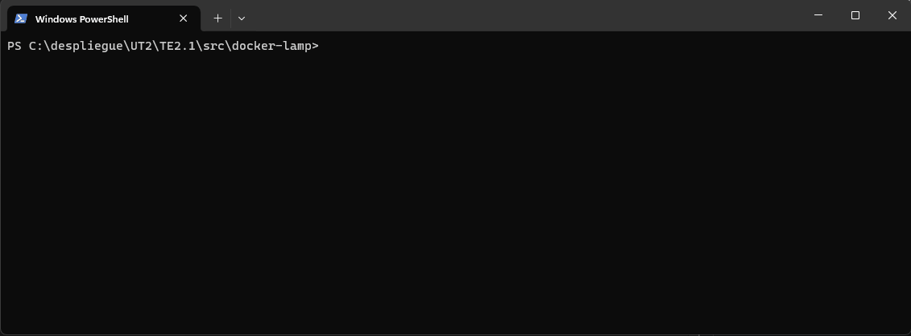

## Tarea Evaluable 2.1.

### Presentación

Tarea del módulo de Desarrollo Aplicaciones Web sobre Docker, desarrollada por:
- Felipe Aldehuela [GitHub](https://github.com/FelipeAldehuela91/) [DockerHub](https://hub.docker.com/u/felipealdehuela91)


### Recursos previos

Asegúrate de tener instalados DOCKER y Docker-compose en tu sistema. Puedes descargarlos aquí según la versión de tu sistema.

### Objetivos

- Explorar las ventajas de la tecnología de contenedores.
- Entender los principios básicos del despliegue de aplicaciones web mediante contenedores.
- Familiarizarse con conceptos esenciales de Docker.
- Trabajar con imágenes y Docker.
- Utilizar Docker y docker-compose para orquestar contenedores.
- Implementar aplicaciones web simples en contenedores.
### Desarrollo

#### Paso 1. Descargar recursos.

1. Descarga de recursos.
Crea una carpeta de trabajo llamada "UT2/T2.1" usando la terminal con "mkdir" o el explorador de archivos con "Nueva Carpeta". Luego, organiza la estructura de la carpeta.

     

2. Descargar el archivo [Recurso](https://github.com/jssfpciclos/DAW_daweb/blob/main/UT2/TE2.1/res/Tarea2.1.recursos.rar), copiarla a la carpeta de trabajo **"UT2/src/docker-lamp"** y la descomprimimos.

    

#### Paso 2. Imagen docker PHP

En este paso, generaremos una imagen Docker que incluya Apache y PHP, basada en la imagen oficial de PHP 8.0.0 con Apache, integrando el controlador de MySQL para PHP. Se pueden seguir dos métodos: construir la imagen paso a paso o utilizar un DOCKERFILE. A continuación, se explica el método paso a paso.

##### Paso a paso #####

1. Descargar la imagen con el siguiente comando:

   - docker run -ti --name daw_te2_1 php:8.0.0-apache /bin/bash

   - docker run -> comando para crear contenedores desde imágenes.
   - -ti -> parámetro para crear un contenedor interactivo.
   - --name daw_te2_1 -> asigna un nombre al contenedor.
   - php:8.0.0-apache -> nombre de la imagen a utilizar, con la versión 8.0.0 que incluye Apache.

    

    Despues de ejecutar el comando podemos observar que en nuestra consola estamos logueado dentro del contenedor. Todo comando que ejecutemos aqui se queda dentro del contenedor.

    

2. Instalar el driver de MySQL.

    ```
    docker-php-ext-install mysqli
    ```

    Con este comando instalamos el driver dentro del contenedor

    
   
3. Instalación de librerías del driver MySQL
    Ejecuta los siguientes comandos para instalar las librerías necesarias del driver MySQL:

    ```
    apt-get update

    apt-get install -y sendmail libpng-dev 
    apt-get install -y libzip-dev 
    apt-get install -y zlib1g-dev 
    apt-get install -y libonig-dev 
    rm -rf /var/lib/apt/lists/* 
    docker-php-ext-install zip
    
    docker-php-ext-install mbstring
    docker-php-ext-install zip
    docker-php-ext-install gd
    ```

    Estas librerías son esenciales para el correcto funcionamiento del driver MySQL.

4. Habilitación del módulo "rewrite" de Apache
    Para habilitar el módulo "rewrite" de Apache, ejecuta el siguiente comando:

    - a2enmod rewrite

<br><br>
Luego de estos pasos, tu contenedor estará listo para su uso. Para construir una imagen de este contenedor, sigue los siguientes pasos:

- Sal del contenedor usando exit y regresa a tu entorno principal.

- Ejecuta el siguiente código:

  -  docker ps -a

    Este comando te mostrará todos los contenedores, ya sea en ejecución o no. Presta especial atención al ID del contenedor.

    

- Creamos una imagen del contenedor anterior con el siguiente código:

   - docker commit 786cf5994ade DAW_PHP_Apache_MySQl

    Con **commit** creamos una imagen. Para ello introducimos dos parámetros el id del contenedor base y el nombre de la imagen que queremos crear.

    


##### DOCKERFILE #####

Simplificamos el proceso paso a paso mediante archivos DOCKERFILE. Este archivo de texto plano, ubicado en "TE2.1/src/", contiene el siguiente código:

```
FROM php:8.0.0-apache
 
RUN docker-php-ext-install mysqli
RUN apt-get update \
    && apt-get install -y sendmail libpng-dev \
    && apt-get install -y libzip-dev \
    && apt-get install -y zlib1g-dev \
    && apt-get install -y libonig-dev \
    && rm -rf /var/lib/apt/lists/* \
    && docker-php-ext-install zip

RUN docker-php-ext-install mbstring
RUN docker-php-ext-install zip
RUN docker-php-ext-install gd

RUN a2enmod rewrite
```

Este código refleja las mismas acciones que el apartado anterior, pero con dos comandos diferenciados.

- FROM: Indica la procedencia de la imagen con la que trabajaremos.
- RUN: Ejecuta comandos dentro de la imagen durante el proceso de creación.
Es crucial entender la creación de capas dentro de una imagen. Cada capa representa un cambio realizado en la imagen, siendo de solo lectura y compartible entre varios contenedores. Reducir las capas mejora el rendimiento. En nuestro caso, las instalaciones de librerías para el driver de MySQL se han consolidado en una sola línea de comando.

Para construir la imagen, ejecutamos:

```
docker build -t php-apache8.0-sdf:1.0 .
```

- build: Construye la imagen. Al usar un Dockerfile, colocamos un "." al final.
- -t: Indica la versión de la imagen.
- php-apache8.0-sdf:1.0: Nombre de la imagen, con ":" añadiendo la versión.


Para comprobar que nuestra imagen se ha creado ejecutamos:

```
docker images
```


Como se puede observar, simplifica mucho la creacion de una imagen. Con un archivo y un solo comando creamos una imagen lista para funcionar.

Por último borraremos esta imagen para que no interfiera en el resto de la práctica

```
docker rmi ad82f768cc87

docker images
```


#### Paso 3. Docker-compose

Para crear un servicio con varias imágenes y contenedores, utilizaremos docker-compose. Este utiliza un archivo YML para listar todas las instrucciones necesarias en la creación del servicio, dividiéndose principalmente en tres partes: servicios, volúmenes y redes.

##### SERVICIOS #####

En la sección de servicios, incluiremos todas las imágenes que vamos a utilizar, definiendo sus características. A continuación, se presenta la construcción de la primera imagen llamada "www", basada en la imagen creada en el apartado anterior. No es necesario volver a escribir todo el código anterior, simplemente hacemos referencia al archivo Dockerfile que construimos previamente. El código a trabajar es el siguiente:

- www:

    Esta es la primera imagen que construiremos. Esta imagen se basará en la imagen que hemos construido en el apartado anterior. Para construirla aqui no hace falta escribir todo lo anterior, si no que haremos refeencia al archivo **Dockerfile** que hemos construido anteriormente (este es el motivo que por el que hemos eliminado la imagen que se creó)
    
    El código qon el que trabajaremos será:

    ```
    www:
        build: .
        image: daw/lamp-apache-php8-sdf:1.0
        ports: 
            - "9000:80"
        volumes:
            - ./www:/var/www/html
        depends_on:
            - db
        networks:
            - lamp-network
    ```

    Este código tan raro que hemos introducido lo vamos a desarrollar poco a poco:

    Desarrollamos cada parte del código:

    - www: Nombre del servicio. En esta imagen construiremos la base de todo nuestro servicio, incluyendo PHP, Apache y MySQL, así como nuestros archivos.
    - build: Define cómo construiremos la imagen. Al tener un Dockerfile, usamos "." para referenciarlo, ya que está en la misma carpeta que el archivo docker-compose.
    - image: Define el nombre de la imagen a construir y su versión.
    - ports: Define el/los puerto/s que utilizará la imagen. Se configura colocando primero el puerto del host y luego el del contenedor, separados por ":". En el ejemplo, el host (nuestro ordenador) tendrá el puerto 9000 y el contenedor tendrá el puerto 80.
    - volumes: Define la/s carpeta/s compartida/s con nuestro sistema. Al igual que los puertos, cada carpeta se define en una lista.
    depends_on: Un contenedor puede ser independiente o depender de otro/s. Aquí se puede definir esta dependencia.
    - networks: Se asigna la red con la que trabajará. Puede ser una red propia de Docker o una personalizada.
    Para probar esta parte, ejecutamos el siguiente comando en la consola:

    ```
    docker-compose up --build
    ```

    

    Observamos que una vez terminada la construcción de la imagen, no podemos realizar ninguna acción en la consola. Docker-compose permanece en modo "attached", es decir, en modo de espera. A través de la consola, mostrará los registros que se generen en el contenedor.

    

    Para salir de este modo, simplemente presiona la combinación de teclas "Ctrl + c". Esto cerrará el contenedor y lo eliminará.

    Si deseamos evitar el modo attached al ejecutar docker-compose, podemos utilizar el modo detached. De esta manera, podemos mantener el control de la consola en todo momento. Para lograrlo, modificamos el código anterior añadiendo "-d" a la línea de comando.

    ```
    docker-compose up -d --build 
    ```

- db:

    Este servicio se encargará de gestionar la base de datos. El código que lo define es:

    ```
    db:
        image: mysql:8.0
        container_name: lamp-mysql-sdf
        ports: 
            - "3399:3306"
        command: --default-authentication-plugin=mysql_native_password
        environment:
            MYSQL_DATABASE: dbname
            MYSQL_ROOT_PASSWORD: test 
            MYSQL_USER: lamp
            MYSQL_PASSWORD: lamp
        volumes:
            - ./dump:/docker-entrypoint-initdb.d
            - ./conf:/etc/mysql/conf.d
            - db_data:/var/lib/mysql
        networks:
            - lamp-network
    ```

    
    Desarrollamos cada parte del código:

    - db: Nombre del servicio.
    - container_name: Definimos el nombre del contenedor creado durante el proceso.
    - ports: Define el/los puerto/s que utilizará la imagen. Al igual que antes, se configura colocando primero el puerto del host y luego el del contenedor, separados por ":". En este ejemplo, el host (nuestro ordenador) tendrá el puerto 3306 y el contenedor tendrá el puerto 3306.
    - environment: Se declaran las variables de entorno del contenedor. En este caso, se definen las claves de conexión a la base de datos, contraseñas y/o usuarios.
    - volumes: Define la/s carpeta/s compartida/s con nuestro sistema. Al igual que antes, cada carpeta se define en una lista.
    - networks: Se asigna la red con la que trabajará. Puede ser una red propia de Docker o una personalizada.
    Luego de añadir estas instrucciones, ejecutamos docker-compose para asegurarnos de que todo funciona correctamente. 
    
    ```
    docker-compose up --build
    ```

    

    
    Observamos que, utilizando Workbench u otro programa similar, accedemos sin problemas a la base de datos.

- phpmyadmin

    Este servicio crea un contenedor con phpMyAdmin para la conexión a la base de datos a través del navegador. Se conecta al contenedor de la base de datos.

    Código:

    ```
      phpmyadmin:
      image: phpmyadmin/phpmyadmin
      container_name: lamp-phpmyadmin-sdf
      depends_on: 
          - db
      ports:
          - 8900:80
      environment:
          MYSQL_USER: lamp
          MYSQL_PASSWORD: lamp
          MYSQL_ROOT_PASSWORD: test 
      networks:
          - lamp-network
    ```
    Desglose:

    - phpmyadmin: Nombre del servicio.
    - image: Define la imagen, en este caso, phpMyAdmin.
    - container_name: Nombre del contenedor.
    - depends_on: Dependencia del contenedor de la base de datos.
    - ports: Puertos 8900 del host y 80 del contenedor.
    - environment: Variables de entorno, como las credenciales de conexión.
    - networks: Asignación de red.
    
    Ejecutamos docker-compose para verificar el funcionamiento.

    ```
    docker-compose up --build<br>
    ```

    

    Para poder probar que todo ha ido bien debemos ir esta vez al explorador web (Chrome, Safari, Brave...) y poner en la barra de navegación:

    ```
    localhost:8900
    ```

    Esto nos abrirá directamente la pagina web que tenemos en nuestra carpeta **/www/** y se nos mostrará por el navegador.

    

<br>

Para iniciar docker-compose:

```
docker-compose up
```

Añadir "--build" fuerza la reconstrucción de la imagen, incluso sin cambios:

Para cerrar y desconectar los contenedores:

```
docker-compose close
```

Para finalizar y eliminar los contenedores:

```
docker-compose down
```

Recordar el modo attach y detached. Por defecto, los comandos están en modo attach. Para el modo detached, añadir "-d":

```
docker-compose up -d
```
<br>

    Hasta aquí todo lo que podemos hacer.